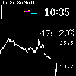
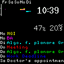

# Raspberry Pi calendar/temperature monitoring station

For more details see https://fliegendewurst.github.io/raspberry-pi-temperature-monitoring.html

The used OLED display is from [Waveshare](https://www.waveshare.com/wiki/1.5inch_RGB_OLED_Module)

## Quick start

```bash
> nix-shell
> rustup target add arm-unknown-linux-musleabihf
> cargo build --release --target arm-unknown-linux-musleabihf
> scp target/arm-unknown-linux-musleabihf/release/{display_all,display_off,refresh_json,take_measurement,status_check_example} 'pi@raspberrypi:~'
> # on the Pi, create sensors.db and events.json
> ./status_check_example > /run/user/1000/status.json
> patchelf --set-interpreter /lib/ld-musl-armhf.so.1 display_all
> ./display_off on
> ./display_all sensors.db events.json temps
```

### Cross compile from NixOS x86_64

Make sure to configure nixpkgs and [nur](https://github.com/nix-community/NUR) below.

```bash
> nix-build -I nixpkgs=.../nixpkgs -I nur=.../nur-packages --arg crossSystem '(import <nixpkgs/lib>).systems.examples.muslpi' .../nur-packages -A raspi-oled-cross
> mkdir /tmp/nixstore
> nix copy --extra-experimental-features nix-command --extra-experimental-features flakes --no-check-sigs --to /tmp/nixstore $(readlink -f result)
> rsync -r --links --info=progress --compress /tmp/nixstore/nix pi@himbeere-null:~/
```

On the Pi:
```bash
> sudo mv nix /
> sudo patchelf --set-interpreter /lib/ld-musl-armhf.so.1 /nix/store/*-raspi-oled-*-infdev-*/bin/*
```

## Example





(the blue text seen in the second image is bright enough on the real OLED display)

## License

Copyright 🄯 2022-2023 FliegendeWurst

This program is free software: you can redistribute it and/or modify
it under the terms of the GNU General Public License as published by
the Free Software Foundation, either version 3 of the License, or
(at your option) any later version.

See [`LICENSE`]. Applies to all files except the ones listed below.

`src/rpi.raw` is the Raspberry Pi logo. Raspberry Pi is a trademark of Raspberry Pi Ltd.